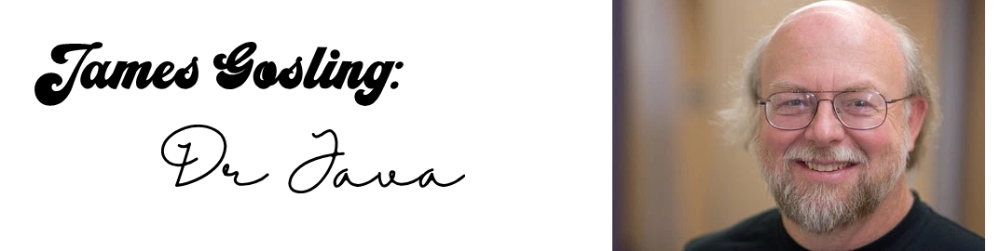

### Introduction and Background
Over the summer, I worked as a Software Development Engineering Intern at Amazon Web Services (AWS) for five months. My team often collaborated with other teams across the globe, rushing to complete features to be announced at AWS re:Invent this year. James Gosling led one of these teams. Every engineer that I encountered at AWS revered Gosling as an extremely talented computer scientist, capable of solving problems of enormous complexity. It was not until I looked into Goslings past accomplishments that I realised how justified this admiration was.  

Gosling was born on the 19th of May 1955 in Alberta, Canada. After receiving a Bachelor of Science in Computer Science from the University of Calgary, he went on to continue his studies at Carnegie Mellon University as a graduate student. While working on his doctorate, he built a multi-processor version of Unix for a 16-way computer system and developed various compilers and mail systems. Goslings dissertation, entitled "The Algebraic Manipulation of Constraints", focussed on the problem of performing constraint satisfaction in an interactive graphical layout system.

### Gosling Emacs
Gosling's first significant contribution to the world of software engineering came in 1981 when he created Gosling Emacs. Gosling Emacs, or "Gosmacs", is a discontinued Emacs implementation written in C. Initially, Gosling permitted the free distribution of "Gosmacs", as was required by the "Emacs Commune" in the 1980s. Engineers admired "Gosmacs" for its unique display code that used a sophisticated dynamic programming technique to solve the classical string-to-string correction problem. This algorithm was so complex that it was headed by a skull-and-crossbones in ASCII art to warn other engineers that even if they thought they understood how it worked, they probably did not. "Gosmacs" was the first version of Emacs for UNIX.  

Richard Stallman used some of the "Gosmacs" code in the development of the initial version of GNU Emacs, rewriting some of the display code headed by skull-and-crossbones to make it "…shorter, faster, clearer and more flexible". Gosling later sold "Gosmacs" to UniPress, who then asked Stallman to stop distributing his version of Emacs for Unix. Following this, Richard Stallman removed all the "Gosmacs" code entirely from GNU Emacs by version 16.56. These disputes inspired Stallman to create the first formal license for Emacs, as Congress had introduced copyright for software in 1980.

### The Impact of Gosling Emacs
In 1989, Richard Stallman wrote the GNU General Public License (GPL) to produce one license that could be used for any project. The original GPL was based on a unification of similar licenses for early versions of the GNU Debugger, the GNU C Compiler and the aforementioned GNU Emacs. While we cannot credit Gosling with the creation of the GPL, we can recognise the role that "Gosmacs" played in the early stages of the license. The relationship between the GNU Emacs License and "Gosmacs" is clear, as Stallman created the GNU Emacs License following the previously mentioned disputes from UniPass.  

The three licenses listed above contained similar provisions to the modern GPL, but were specific to each program. This made the licenses incompatible, despite being the same license. Historically, the GPL license family has been one of the most popular software licenses in the free and open-source software domain. Examples of prominent free software programs licensed under the GPL include the Linux kernel and the GNU Compiler Collection (GCC). It is salient that Gosling made an impact on the GPL, as the GPL is based on a license that "Gosmacs" inspired.

### The Java Programming Language
Without a doubt, Goslings most outstanding contribution to software engineering and computer science is the creation of the Java programming language. Java was initially developed by Gosling at Sun Microsystems and released in 1995 as a core component of Sun Microsystems' Java platform. Java is a class-based, object-oriented programming language that is designed to have as few implementation dependencies as possible. It is a general-purpose programming language intended to let application developers "write once, run anywhere", meaning that compiled Java code can run on all platforms that support Java without the need for recompilation. Java syntax is like C and C++ but has fewer low-level facilities than either of them.  

Originally, Java was designed for interactive television, but it was too advanced for the digital cable television industry at the time. Initially, the language was called Oak, after an oak tree that stood outside Gosling's office. There were five primary goals in the creation of the Java programming language:
1. It must be simple, object-oriented, and familiar.
2. It must be robust and secure.
3. It must be architecture-neutral and portable.
4. It must be executable with high performance.
5. It must be interpreted, threaded and dynamic.
Java quickly became one of the most popular programming languages after Sun Microsystems released the first public implementation as Java 1.0 in 1996 and most major web browsers incorporated the ability to run Java applets within web pages. Today, Java runs on everything from laptops and games consoles to scientific computers.

### The Java Virtual Machine (JVM)
Portability is a vital component of the Java design, meaning that programs written for the Java platform must run similarly on any combination of hardware and operating system with adequate run-time support. Gosling achieved this by designing the platform so that Java language code is compiled to an intermediate representation called Java bytecode, instead of directly to architecture-specific machine code. Java bytecode instructions are analogous to machine code, but they are intended to be executed by a virtual machine explicitly written for the host hardware. End-users use a Java Runtime Environment (JRE) installed on their device for standalone Java applications, or in a web browser for Java applets.  

This innovative use of universal bytecode makes porting simple. However, the overhead of interpreting bytecode into machine instructions makes interpreted programs almost always run more slowly than native executables. On the 13th of November 2006, Sun released much of its JVM as free and open-source software, under the terms of the GNU GPL. On the 8th of May 2007, Sun finished the process, making all of its JVM's core code available under free software/open-source distribution terms, aside from a small portion of code to which Sun did not hold the copyright.  

### Automatic Memory Management in Java
Java uses an automatic garbage collector (AGC) to manage memory in the object lifecycle. All the programmer has to determine is when objects are created. The Java runtime manages the recovery of memory once objects are no longer in use. When all references to an object are removed, the unreachable memory is freed automatically by the garbage collector after some time. An event similar to a memory leak can occur if references to unused objects that are no longer needed are stored in containers that are still in use.  If methods for a non-existent object are called, a null pointer exception is thrown.  

Garbage collection may happen at any time. The ideal time for it to occur is when the program is idle. Garbage collection is guaranteed to be trigged if there is not enough free memory on the heap to allocate a new object, which can cause the stalling of a program momentarily. Explicit memory mangement is possible in languages like C/C++ but is not possible in Java. In the same way, Java does not support pointer arithmetic, where object addresses can be manipulated directly by addition or subtraction. This guarrantees the type safety and security when the garbage collector relocates referenced objects.  

### The Impact of Java
Java is at the core of our digital life. It powers many tools which we use in our everyday lives and has influenced the IT industry in a monumental way. For instance, Twitter manages over 400 million tweets per day through a reliable infrastructure powered by Java. Netflix handles 2 billion content requests per day with seamless connectivity through Java-based support. Hence, over 12 million developers trust Java for their various assignments and industrial projects, making Java the most used programming language worldwide. These trends are results of Java's constant effort to upgrade its core libraries to include elements needed for the latest technological challenges. Java has seen constant evolution in terms of its rich set of APIs, frameworks, libraries, IDEs and development tools. Java has an expansive collection of libraries that supports new-age technologies like:  

1. Cloud Computing
2. Big Data
3. Internet of Things
4. Machine Learning and Artificial Intelligence
5. Gaming and Animations

The introduction of the JVM was revolutionary. Perhaps the biggest influence that Java had on programming was the JVM and the many benefits associated with a virtual machine. The JVM was the leader in support for the "write once, run anywhere" paradigm. Not only did this increase the ease of portability of Java applications, but it influenced the movement to standardise the memory sizes of data types across different platforms. Java's garbage collection mechanism was an almost-too-good-to-be-true feature for developers who had primarily been using languages that required the careful management of memory deallocation.  

Another significant change that came with the adoption of Java was the spread of Test-driven development (TDD). TDD had been tried earlier with Smalltalk but did not achieve widespread notice and adoption until it became available in Java through JUnit. TDD rapidly ascended from an experimental practice to the standard way to write code in the 21st century when Kent Beck and Erich Gamma released JUnit in 2000. As Martin Fowler said, "Never in the field of software development was so much owed by so many to so few lines of code," and those few lines of code were written in Java. The widespread adoption of Java forever changed the software development process and it is all owed to its creator, James Gosling.  

Here are three examples of impressive projects that use Java:
- The Java language is a crucial pillar in Android, an open-source mobile operating system. While Android is written in C and built on the Linux kernel, the Android SDK uses the Java language for Android applications. Still, it does not use any of its standard SE, GUI, ME or other established Java standards. Java bytecode is incompatible with the bytecode language supported by the Android SDK, so Android runs its own virtual machine which is optimised for the low-memory devices that use the Android operating system (smartphones and tablets).  
- Markus "Notch" Persson created Minecraft in the Java programming language. It was released in 2009 for personal computers as a paid public alpha. In November 2011, the game was officially released with Jens Bergensten taking over development. Minecraft has since been ported to mobile and console devices and is the best-selling video game of all time. As of 2020, Minecraft has sold 200 million copies and sold 126 million monthly active users.  
- NASA World Wind is proprietary, open-source software. This project is written and Java and uses the OpenFL stack. When a user starts the program, low-resolution maps of the world are displayed. The user can then zoom in to different areas on the map, where high-resolution images are downloaded from NASA servers. This program gives the user a lot of control, allowing them to select the scale, direction and viewing angle, as well as search by geographical names. GPS plugins also exist for displaying weather features such as clouds and hurricanes in real-time.

### Conclusion
It is clear from my above arguments that Gosling is a crucial software engineer whose contributions to the field have impacted future engineers for generations. Java technology is unparalleled, now running in over 1.5 billion devices worldwide. Working alongside James Gosling at AWS was an incredible experience that taught me so much about problem-solving and leadership. It is an opportunity that I will likely never have again.

-----
### Sources
Hsu, Hansen, and Marc Weber. Oral History of James Gosling, Part 1 of 2. 5 Mar. 2019. https://www.youtube.com/watch?v=TJ6XHroNewc&t=11040s  

Hsu, Hansen, and Marc Weber. Oral History of James Gosling, Part 2 of 2. 5 Mar. 2019. https://www.youtube.com/watch?v=LaJtYHvpa68  

"The GNU Operating System- GNU Project - Free Software Foundation." Gnu.org, 2014, www.gnu.org/gnu/gnu.html. Accessed 9 Nov. 2020.  

Richard Stallman (7 January 2013), "samzenpus" (ed.), Richard Stallman Answers Your Questions, Slashdot  

Tyson, Matthew. “What Is the JVM? Introducing the Java Virtual Machine.” InfoWorld, 17 Jan. 2020, www.infoworld.com/article/3272244/what-is-the-jvm-introducing-the-java-virtual-machine.html. Accessed 7 Nov. 2020.  

Harold, Elliotte Rusty. "Java at 20: How It Changed Programming Forever." InfoWorld, 21 May 2015, www.infoworld.com/article/2923773/java-at-20-how-java-changed-programming-forever.html. Accessed 8 Nov. 2020.  

